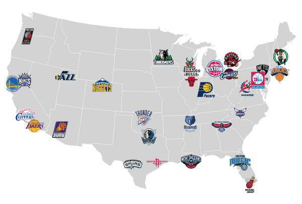

```{css, echo=FALSE} 

span{
  font-family: helvetica;
}

a{
  font-family: helvetica;
}

.nav-pills>li.active>a:focus {
    color: #ffffff;
}

.container-fluid, .container-fluid h1 {
    font-family: helvetica;
    line-height: 1.7;
}

.container-fluid p {
    font-family: helvetica;
}

h1,h2,h3,h4,h5,h6,p, table {
  font-family: helvetica;
}
```

```{r packages-setup, include = FALSE}
library(tidyverse)
library(klippy)  #- remotes::install_github("rlesur/klippy")
library(knitr)
library(rio)
library(ggplot2)
library(gganimate)
library(ggThemeAssist)
library(remotes) 
library(gt)
library(plotly)
library(readxl)
library(treemap) #install.packages(treemap)
library(d3treeR) #remotes::install_github("d3treeR/d3treeR")
library(magick)
library(stringr)
library(tmap)
library(flextable)
library(officer)
library(png)
library(grid)
library(jpeg)
library(ggpubr) #install.packages('ggpubr')

```

```{r chunk-setup, include = FALSE}
knitr::opts_chunk$set(echo = TRUE, eval = TRUE, message = FALSE, warning = FALSE, 
                      #results = "hold",
                      cache = FALSE, cache.path = "/caches/", comment = "#>",
                      #fig.width = 7, #fig.height= 7,   
                      #out.width = 7, out.height = 7,
                      collapse = TRUE,  fig.show = "hold",
                      fig.asp = 0.628, out.width = "75%", fig.align = "center")
knitr::opts_chunk$set(dev = "png", dev.args = list(type = "cairo-png"))
```


```{r options-setup, include = FALSE}
options(scipen = 999) #- para quitar la notación científica
options("yaml.eval.expr" = TRUE) 
```


```{r klippy, echo = FALSE}
klippy::klippy(position = c("top", "right")) #- remotes::install_github("rlesur/klippy")
```

```{r, echo=TRUE}
contratos <- rio::import("./datos/contratos/nba_contracts_history.csv")

jug_act2021 <- import("./datos/nba_2122/active_players_2.csv")
jugadores2021 <- import("./datos/nba_2122/players.csv")

partidos_detalle <- rio::import("./datos/nba_games/games_details.csv")
partidos <- rio::import("./datos/nba_games/games.csv")
jugad_part <- rio::import("./datos/nba_games/players.csv")
ranking_part <- rio::import("./datos/nba_games/ranking.csv")
equipos_part <- rio::import("./datos/nba_games/teams.csv")

all_jug <- rio::import("./datos/nba_players/all_seasons.csv")

jug_info <- rio::import("./datos/nba_players_2/player_data.csv")
jug_college <- rio::import("./datos/nba_players_2/Players.csv")
seasons_stats_jug <- rio::import("./datos/nba_players_2/Seasons_Stats.csv")

awards <- rio::import("./datos/nba_stats/player_awards.csv")
all_nba <- rio::import("./datos/nba_stats/end_season_teams.csv")
team_totals <- rio::import("./datos/nba_stats/team_totals.csv")
team_per_game <- rio::import("./datos/nba_stats/team_per_game.csv")
advanced_stats <- rio::import("./datos/nba_stats/advanced.csv")

player_shooting <- rio::import("./datos/nba_stats/player_shooting.csv")

campeones <- rio::import("./datos/franquicias.xlsx")
```


<hr class="linea-black">

<!-- El párrafo de abajo has de dejarlo casi igual, solo HAS de SUSTITUIR "perezp44" por tu usuario de Github-->
Trabajo elaborado para la asignatura "Programación y manejo de datos en la era del Big Data" de la Universitat de València durante el curso 2021-2022. El repo del trabajo está [aquí](https://github.com/cayetano108/trabajo_BigData){target="_blank"}. 

<!-- El párrafo de abajo has de dejarlo exactamente igual, NO HAS DE CAMBIAR NADA-->

La página web de la asignatura y los trabajos de mis compañeros pueden verse [aquí](https://perezp44.github.io/intro-ds-21-22-web/07-trabajos.html){target="_blank"}.


<hr class="linea-red">


<!-- aquí empieza el trabajo -->


# 1. Introducción

La NBA es una de las competiciones más importantes y seguidas del mundo, además de ser la competición más importante y de más nivel baloncestístico. Se trata de una liga cerrada, de 30 equipos, sin ascensos ni descensos, al contrario de lo que estamos acostumbrados en las competiciones deportivas en España.

<br><br>

<center>
{width=540 height=300}
</center>

# 2. Datos

Los datos utilizados en el trabajo, han sido obtenidos de la página web [kaggle](https://www.kaggle.com/), web con múltiples herramientas útiles para el manejo y análisis de datos, como pueden ser conjuntos de datos, scripts, competiciones, etc. Más concretamente, los conjuntos de datos utilizados son: [NBA Players](https://www.kaggle.com/justinas/nba-players-data), [NBA games data](https://www.kaggle.com/nathanlauga/nba-games), [NBA Players stats since 1950](https://www.kaggle.com/drgilermo/nba-players-stats) y [NBA Player Salary Dataset (2017 - 2018)](https://www.kaggle.com/koki25ando/salary)

# 3. Funcionamiento

## 3.1 Temporada

La temporada NBA suele comenzar a mediados de octubre, cuando comienza la temporada regular (regular season), en la que cada equipo jugará 82 partidos. Los calendarios y numero de enfrentamientos entre cada equipo lo dictamina la conferencia y la división en la que se encuentre cada equipo. Existen 2 conferencias, Este y Oeste, y cada una de ellas aportará sus 8 equipos mejor clasificados a la post-temporada (playoffs).

[*Debido al COVID-19, cada conferencia aportará 6 equipos fijos, mas 2 adicionales que resultarán de un play-in jugado por los puestos 7º, 8º, 9º y 10º de cada conferencia.*]{.small}

Finalmente, los playoffs, enfrentamientos al mejor de 7 partidos, en los que el ganador avanza de ronda y el perdedor queda eliminado.
Los campeones de cada conferencia (equipos ganadores del cuadro), se disputarán la Final de la NBA.

<br>

<center>
{width=540 height=400}
</center>

## 3.2 Draft

El draft de la NBA es el proceso por el cuál los jóvenes universitarios y europeos acceden a la liga. A diferencia de como puede pasar en Europa con otros deportes como el fútbol, donde los equipos más ricos pueden llevarse a jugadores prometedores desde muy pequeños a golpe de talonario, en la NBA se realiza un sorteo similar a la lotería, donde los equipos son asignados con diversas rondas del draft (elecciones), con las que pueden elegir a estos talentos. Sólo jugadores menores de 22 años pueden declararse elegibles, y para ellos es la única vía de ingresar a la NBA hasta alcanzar dicha edad, cuando ya podrán firmar como agentes libres.

Este proceso supone la mayor baza en favor de la competitividad entre todas las franquicias integrantes, ya que los equipos con peores resultados en la temporada anterior, tienen mayor probabilidad de obtener rondas altas del draft, considerándose estas como las primeras elecciones. Tanto es así, que en muchas ocasiones, una buena elección en el draft de la NBA puede redirigir el rumbo de una franquicia perdedora hacia un candidato al título durante los años próximos, como lo fueron los Chicago Bulls de Michael Jordan (nº 3 en 1984), los San Antonio Spurs de Tim Duncan (nº 1 en 1997), o los Golden State Warriors de Stephen Curry (nº 7 en 2009), todos ellos superestrellas escogidas en el draft por el equipo campeón.

Para mostrar la importancia del draft en la competición:

<center>

```{r}

lidert_part <- seasons_stats_jug %>% 
  select(Player, G) %>%  
  group_by(Player) %>% 
  mutate(total_part = sum(G)) %>% 
  arrange(desc(total_part)) %>% 
  distinct(Player, total_part)
lidert_part$Player <- gsub("[*]","",lidert_part$Player)


lidert_puntos <- seasons_stats_jug %>% 
  dplyr::rename( "triples" = "3P",  "dospuntos" = "2P") %>% 
  select(Year, Player, triples, dospuntos, FT)

lidert_puntos[is.na(lidert_puntos)] <- 0

lidert_puntos2 <- lidert_puntos %>% mutate(puntos = triples*3 + dospuntos*2 + FT) %>% 
  select(Player, puntos) %>%  
  group_by(Player) %>% 
  mutate(total_puntos = sum(puntos)) %>% 
  arrange(desc(total_puntos)) %>% 
  distinct(Player, total_puntos)
lidert_puntos2$Player <- gsub("[*]","",lidert_puntos2$Player)

ppp <- left_join(lidert_part, lidert_puntos2, c('Player' = 'Player')) %>% mutate(pointspg = total_puntos/total_part) %>% 
  filter( pointspg < 500) %>% 
  arrange(desc(pointspg))

ppp_draft <- left_join(ppp, all_jug, c('Player' = 'player_name'))  %>% 
  select(Player, total_part, total_puntos, pointspg, draft_number) %>% 
  distinct(pointspg, draft_number) %>% na.omit() %>% group_by(draft_number) %>% 
  mutate(media_draft = mean(pointspg)) %>% 
  distinct(draft_number, media_draft) %>% 
  arrange(desc(media_draft))

#correlación elección del draft con puntos anotados
ppp_draft[, c(1)] <- sapply(ppp_draft[, c(1)], as.numeric)

ppp_draft_num <- ppp_draft %>%  filter(draft_number < 61) %>% filter(draft_number > 0) 


gg_draft <- ggplot(ppp_draft_num, aes(x=draft_number, y=media_draft)) +
  geom_point() +
  geom_smooth(method=lm , color="red", fill="yellow", se=TRUE) + 
   scale_x_continuous(
    breaks = seq(0, 60, 5),
    limits = c(0, 60))+
   scale_y_continuous(
    breaks = seq(0, 18, 2),
    limits = c(0, 18)) + theme(axis.line = element_line(colour = "yellow",
    linetype = "solid"), panel.grid.major = element_line(linetype = "blank"),
    panel.grid.minor = element_line(linetype = "blank"),
    plot.title = element_text(size = 15,
        hjust = 0.5), panel.background = element_rect(fill = "beige"),
    plot.background = element_rect(fill = "beige")) +labs(title = "Media de puntos por elección",
    x = "Nº Draft", y = "Media de puntos por partido")
ggplotly(gg_draft)

```

</center>

Para la realización de este gráfico, se han tenido en cuenta los puestos en los que han sido elegidos cada uno de los jugadores de la NBA en toda su historia, y la media de puntos por partido que poseen en su carrera. Y realizando la media por cada una de las posiciones, obtenemos una correlación positiva entre las primeras elecciones del draft, y los mayores valores en puntos por partido.


Por último, para afianzar esta idea, veamos la relación entre la posición de elección en el draft con el premio individual más prestigioso de la competición, el MVP.

<center>

```{r}
premios <- awards %>% filter(winner == 'TRUE') %>% group_by(award, player) %>% 
  mutate(mas_premios = sum(NN = n())) %>% 
  distinct(player, award, mas_premios)

mvp <- premios %>% filter(award == 'nba mvp') %>% arrange(desc(mas_premios)) 
mvp$player <- iconv(mvp$player, from = 'UTF-8', to = 'LATIN1')

mvp_draft <- left_join(mvp, all_jug, c('player' = 'player_name')) %>% 
  distinct(player, award, mas_premios, draft_number) %>% na.omit() %>%
  arrange(desc(draft_number))

mvp_draft[, c(4)] <- sapply(mvp_draft[, c(4)], as.numeric)


ggmvp <- ggplot(mvp_draft, aes(x = player, y = draft_number, size = mas_premios)) + geom_point(color='red') + coord_flip() + theme(panel.background = element_rect(fill = "beige"),
    plot.background = element_rect(fill = "beige"),
    legend.key = element_rect(fill = "beige"),
    legend.background = element_rect(fill = "beige")) +labs(x = "Jugador", y = "Nº Draft", size = "Nº MVPs") 
ggplotly(ggmvp)
```

</center>

Cabe mencionar que en el gráfico no aparecen todos los ganadores del MVP en la historia, ya que durante los comienzos el sistema de elección era diferente, por lo que no existe una asignación en el draft para los primeros ganadores.

En cuanto al gráfico, se aprecia perfectamente como los ganadores se sitúan en las primeras elecciones del draft, como Lebron James, nº1 del draft 2003 con 4 MVPs, o Michael Jordan, nº 3 del draft 1984 con 5 MVPs. A modo de excepción, tenemos al actual ganador, Nikola Jokic, que batió el record como MVP elegido más tarde en un Draft, concretamente en la posición nº 41 en 2014.


# 4. Líderes estadísticos

La estadística es un apartado fundamental en la NBA. El desempeño de los jugadores se mide en gran parte por la capacidad que éstos tienen para ayudar el equipo en términos cuantitativos con puntos anotados, asistencias, rebotes, etc...

Primero que nada, un repaso por los líderes estadísticos históricos

```{r}
lidert_puntos <- seasons_stats_jug %>% 
  dplyr::rename( "triples" = "3P",  "dospuntos" = "2P") %>% 
  select(Year, Player, triples, dospuntos, FT)

lidert_puntos[is.na(lidert_puntos)] <- 0

lidert_puntos2 <- lidert_puntos %>% mutate(puntos = triples*3 + dospuntos*2 + FT) %>% 
  select(Player, puntos) %>%  
  group_by(Player) %>% 
  mutate(total_puntos = sum(puntos)) %>% 
  arrange(desc(total_puntos)) %>% 
  distinct(Player, total_puntos) %>% 
  filter(total_puntos > 32000) %>% 
  rename('Nombre' = 'Player', 'Puntos' = 'total_puntos')

lidert_puntos2$Nombre <- gsub("[*]","",lidert_puntos2$Nombre)

knitr::kable(lidert_puntos2, caption = "Máximos Anotadores") %>% 
  kableExtra::kable_styling(bootstrap_options = c("striped", "hover"))  %>% 
  kableExtra::kable_styling(fixed_thead = list(enabled = T, background = "orange"))
```

[Datos de 2017, a fecha de 07/01/2022, Lebron James es el 3er máximo anotador con 36.107 puntos]{.small}

```{r}
lidert_asist <- seasons_stats_jug %>% 
  select(Player, AST) %>%  
  group_by(Player) %>% 
  mutate(total_asist = sum(AST)) %>% 
  arrange(desc(total_asist)) %>% 
  distinct(Player, total_asist) %>% 
  filter(total_asist > 10000) %>% 
  rename('Nombre' = 'Player', 'Asistencias' = 'total_asist')
lidert_asist$Nombre <- gsub("[*]","",lidert_asist$Nombre)

knitr::kable(lidert_asist, caption = "Máximos Asistentes") %>% 
  kableExtra::kable_styling(bootstrap_options = c("striped", "hover"))  %>% 
  kableExtra::kable_styling(fixed_thead = list(enabled = T, background = "orange"))


lidert_rebotes <- seasons_stats_jug %>% 
  select(Player, TRB) %>%  
  group_by(Player) %>% 
  mutate(total_rebotes = sum(TRB)) %>% 
  arrange(desc(total_rebotes)) %>% 
  distinct(Player, total_rebotes) %>% 
  filter(total_rebotes > 17000) %>% 
  rename('Nombre' = 'Player', 'Rebotes' = 'total_rebotes')
lidert_rebotes$Nombre <- gsub("[*]","",lidert_rebotes$Nombre)

knitr::kable(lidert_rebotes, caption = "Máximos Reboteadores") %>% 
  kableExtra::kable_styling(bootstrap_options = c("striped", "hover"))  %>% 
  kableExtra::kable_styling(fixed_thead = list(enabled = T, background = "orange"))


lidert_robos <-  seasons_stats_jug %>% 
  select(Player, STL) %>%  
  group_by(Player) %>% 
  mutate(total_robos = sum(STL)) %>% 
  arrange(desc(total_robos)) %>% 
  distinct(Player, total_robos) %>% 
  filter(total_robos > 2400) %>% 
  rename('Nombre' = 'Player', 'Robos' = 'total_robos')
lidert_robos$Nombre <- gsub("[*]","",lidert_robos$Nombre)

knitr::kable(lidert_robos, caption = "Máximos Recuperadores") %>% 
  kableExtra::kable_styling(bootstrap_options = c("striped", "hover"))  %>% 
  kableExtra::kable_styling(fixed_thead = list(enabled = T, background = "orange"))


lidert_tapones <- seasons_stats_jug %>% 
  select(Player, BLK) %>%  
  group_by(Player) %>% 
  mutate(total_tapones = sum(BLK)) %>% 
  arrange(desc(total_tapones)) %>% 
  distinct(Player, total_tapones) %>% 
  filter(total_tapones > 2900) %>% 
  rename('Nombre' = 'Player', 'Tapones' = 'total_tapones')
lidert_tapones$Nombre <- gsub("[*]","",lidert_tapones$Nombre)

knitr::kable(lidert_tapones, caption = "Máximos Taponadores", caption_colour = 'red') %>% 
  kableExtra::kable_styling(bootstrap_options = c("striped", "hover")) %>% 
  kableExtra::kable_styling(fixed_thead = list(enabled = T, background = "orange"))
```


## 4.1 Hacia el triple

Dentro del apartado estadístico, me interesa analizar la incidencia de los triples en la NBA actual.

Antes que nada, es preferible introducir la figura del tiro de 3 puntos. Se trata de una línea situada a 6,70 metros de distancia al aro desde las bandas, y a 7,25 metros desde la parte frontal. Estas medidas no corresponden con el baloncesto europeo (reglas FIBA) ni el baloncesto universitario, con líneas más próximas en ambos.

Esta implementación no se encontraba en las reglas del juego originales, y en la NBA no se implantó hasta la temporada 1979-1980. Se creó como una forma de contrarrestar la absoluta dominancia de los hombres más altos, los cuales dominaban la pintura provocando un sobreuso de los tiros en distancias cercanas. 

Con el triple en la NBA, se produjo una mayor redistribución en la distancia de los tiros realizados, pero recientemente, especialmente desde la dinastía de los Golden State Warriors, la incidencia del triple en los partidos ha experimentado un ascenso meteórico. Mientras que antes se consideraba como un arma complementaria, con especialistas dedicados específicamente a lanzar desde la línea de 3, estos últimos años, el triple ha sido considerado como la principal herramienta de ataque para muchas franquicias.

Esto puede verse tanto en la distancia a la que están dispuestos a lanzar los tiradores hoy en día, como en los porcentajes de acierto.


Aquí podemos apreciar como la distancia media de los lanzamientos realizados ha aumentado considerablemente desde la temporada 1997-1998 hasta la actualidad, demostrándose como la cultura del triple ha sido cada vez más relevante.

```{r}
player_shooting <- rio::import("./datos/nba_stats/player_shooting.csv")

dist_media <- player_shooting %>% group_by(season) %>% 
  mutate(media_dist = mean(avg_dist_fga, na.rm = TRUE)) %>% 
  distinct(season,media_dist) %>% 
  mutate(metros = media_dist/3.281)

curry <- readJPEG("./imagenes/curry.jpg")
curry <- rasterGrob(curry, width = unit(1, "npc"), height = unit(1, "npc"), interpolate = TRUE) 

ggdist <- ggplot(dist_media, aes(x = season, y = metros)) +
  annotation_custom(curry, xmin = -Inf, xmax = Inf, ymin = 1.7, ymax = 4.25) +
  geom_ribbon(aes(xmin = 1995, xmax=2025, ymin = metros, ymax = Inf), fill = "beige") +
  geom_ribbon(aes(xmin=-Inf, xmax= 1997), fill = "beige")+
  #geom_ribbon(aes(xmin=-Inf, xmax= 1997), fill = "white")+
  
  geom_line(size=1, colour="red") + geom_point(colour="red") +
  scale_x_continuous(
    breaks = seq(1997, 2022, 2),
    limits = c(1997, 2022))+
  scale_y_continuous(
    breaks = seq(3, 4.5, 0.25),
    limits = c(3, 4.5))+
  labs(
    title = "Distancia Media de Lanzamientos",
    subtitle = "1997-2022",
    x="Año",
    y="Metros",
    caption="Stephen Curry, realizando su triple nº 3000") +
  theme_minimal() +
  theme(plot.title = element_text(face="bold", hjust=0.5, size=rel(1.5)),
        plot.subtitle = element_text(face="italic", hjust=0.5)) + theme(panel.grid.major = element_line(linetype = "blank"),
    panel.grid.minor = element_line(linetype = "blank"),
    panel.background = element_rect(fill = "beige"),
    plot.background = element_rect(fill = "beige"))

ggdist
```

La evolución en cuanto a porcentajes, no hace más que confirmar la idea planteada anteriormente, cada vez se tiran más triples, y con mayor acierto.


```{r}
seasons_stats_jug <- rio::import("./datos/nba_players_2/Seasons_Stats.csv")

perc_triple <- seasons_stats_jug %>% dplyr::rename( "three_perc" = "3P%") %>% 
  select(Year, Player, three_perc) %>% 
  group_by(Year) %>% 
  mutate(perc3_total = mean(three_perc, na.rm = TRUE)) %>%
  distinct(Year, perc3_total)


perc_triple_pivot <- seasons_stats_jug %>% filter(Pos %in% c('C', 'PF', 'C-PF','PF-C')) %>% 
  dplyr::rename( "three_perc" = "3P%") %>% 
  select(Year, Player, three_perc) %>% 
  group_by(Year) %>% 
  mutate(perc3_total_pivot = mean(three_perc, na.rm = TRUE)) %>%
  distinct(Year, perc3_total_pivot)

perc_3_final <- left_join(perc_triple, perc_triple_pivot, c('Year' = 'Year')) %>% filter(Year >= 1980) %>% round(digits = 2) %>% 
  mutate(porc_triple = perc3_total*100) %>% 
  mutate(porc_triple_pivot = perc3_total_pivot*100)
  

perc_3_final[, c(2)] <- sapply(perc_3_final[, c(2)], as.numeric)
perc_3_final[, c(3)] <- sapply(perc_3_final[, c(3)], as.numeric)

gg3total <- ggplot(perc_3_final, aes(x = Year, y = porc_triple)) + geom_line(colour = 'gray50', size = 1.2) + 
  theme(plot.title = element_text(size = 10,
    hjust = 0.5), panel.background = element_rect(fill = "beige"),
    plot.background = element_rect(fill = "beige")) +labs(title = "Evolución del % de acierto en triples",
    x = "Año", y = "% acierto") + theme(panel.grid.major = element_line(linetype = "blank"),
    panel.grid.minor = element_line(linetype = "blank"))


gg3pivot <- ggplot(perc_3_final, aes(x = Year, y = porc_triple_pivot)) + geom_line(colour = 'darkblue', size = 1.2) + 
  theme(plot.title = element_text(size = 10, hjust = 0.5), panel.background = element_rect(fill = "beige"), 
        plot.background = element_rect(fill = "beige")) +
  labs(title = "Evolución del % de acierto en triples en PIVOTS", x = "Año", y = "% acierto") + theme(panel.grid.major = element_line(linetype = "blank"),
    panel.grid.minor = element_line(linetype = "blank"))


ggarrange(gg3total, gg3pivot,
          ncol = 2, nrow = 1)
```

Especialmente destacado el aumento del porcentaje en los pívots, los hombres más altos. En épocas anteriores, estas posiciones estaban dedicadas a proteger el aro en  busca de rebotes y puntos fáciles cercanos a canasta, pero el 5 tradicional se está **extinguiendo** poco a poco. Cada vez es más raro que un jugador interior no se abra para lanzar de 3.

Este cambio de paradigma ha supuesto una gran polarización en cuanto al uso de las posesiones de cada conjunto. Actualmente, la gran mayoría de estas terminan con un lanzamiento de 3, o con un lanzamiento dentro de la zona (muy cercano al aro), dejando casi obsoleto el lanzamiento de media distancia, provocando que aquellos jugadores que **no** dominaban la faceta del triple, hayan tenido que implementarla en su juego, y por otra parte, aquellos que **solo** actuaban como triplistas, se hayan expandido a otros cometidos.

# 5. Palmarés

Por suerte o por desgracia, la máxima y única aspiración que poseen los equipos de la NBA es conseguir alzarse con el título de campeón al final de cada temporada.

<center>

```{r}

mas_titulos <- campeones %>% group_by(name) %>% mutate(n_titulos = sum(NN = n())) %>% 
  distinct(name, n_titulos) %>% 
  arrange(desc(n_titulos))

id <- rownames(mas_titulos)
mas_titulos <- cbind(id=id, mas_titulos)
mas_titulos[, c(1)] <- sapply(mas_titulos[, c(1)], as.numeric)

label_titulos <- mas_titulos
number_of_bar <- nrow(label_titulos)

angle <- 90 - 360 * (label_titulos$id-0.5) /number_of_bar    
label_titulos$hjust <- ifelse( angle < -90, 1, 0)
label_titulos$angle <- ifelse(angle < -90, angle+180, angle)

base_titulos <- mas_titulos %>% 
  group_by(name) %>% 
  summarise(start=min(id), end=max(id)) %>% 
  rowwise() %>% 
  mutate(title=mean(c(start, end)))

grid_titulos <- base_titulos
grid_titulos$end <- grid_titulos$end[ c( nrow(grid_titulos), 1:nrow(grid_titulos)-1)] + 1
grid_titulos$start <- grid_titulos$start - 1
grid_titulos <- grid_titulos[-1,]

gg_titulos <- ggplot(mas_titulos, aes(x=as.factor(year), y=n_titulos, fill=n_titulos, color = n_titulos)) + geom_bar(aes(x=as.factor(id), y=n_titulos, fill=n_titulos), stat="identity", alpha=0.5) +
  
  geom_segment(data=grid_titulos, aes(x = 0.5, y = 17, xend = 20.9, yend = 17), colour = "grey", alpha=1, size=0.3 , inherit.aes = FALSE ) +
  geom_segment(data=grid_titulos, aes(x = 0.5, y = 10, xend = 20.9, yend = 10), colour = "grey", alpha=1, size=0.3 , inherit.aes = FALSE ) +
  geom_segment(data=grid_titulos, aes(x = 0.5, y = 5, xend = 20.9, yend = 5), colour = "grey", alpha=1, size=0.3 , inherit.aes = FALSE ) +
  geom_segment(data=grid_titulos, aes(x = 0.5, y = 2, xend = 20.9, yend = 2), colour = "grey", alpha=1, size=0.3 , inherit.aes = FALSE ) +
  
  annotate("text", x = 0.3, y = c(2, 5, 10, 17), label = c("2", "5", "10", "17") , color="grey", size=6 , angle=0, fontface="bold", hjust=1) +
  
  geom_bar(aes(x=as.factor(id), y=n_titulos, fill=n_titulos), stat="identity", alpha=0.5) +
  ylim(-10,21) +
  theme_minimal() +
  theme(
    legend.position = "none",
    axis.text = element_blank(),
    axis.title = element_blank(),
    panel.grid = element_blank(),
    plot.margin = unit(rep(-1,4), "cm") ) +
  coord_polar() + 
  geom_text(data=label_titulos, aes(x=id, y=n_titulos+1, label=name, hjust=hjust), color="black", fontface="bold",alpha=0.6, size=5, angle= label_titulos$angle, inherit.aes = FALSE ) + 
  theme(legend.text = element_text(colour = "black"),
                                                                                                                                                       legend.title = element_text( colour = "black"), 
                                                                                                                                                       legend.background = element_rect(fill = "beige", colour = "beige"),
                                                                                                                                                       legend.key = element_rect(fill = "beige"),
                                                                                                                                                       legend.position = "right",
                                                                                                                                                       panel.background = element_rect(fill = "beige" , colour = "beige"),
                                                                                                                                                       plot.background = element_rect(fill = "beige" , colour = "beige"))+labs(colour = "Nº de campeonatos", fill = "Nº de campeonatos") + theme(legend.text = element_text(size = 12),
    legend.title = element_text(size = 15))
#gg_titulos

#las siguientes lineas de codigo se utilizan para eliminar los bordes blancos
ggsave("./plots/gg_titulos.png", width = 18, height = 15)

```

{width=1000 height=750}

</center>

Como claros dominadores, aparecen los Boston Celtics (Este) y Los Angeles Lakers (Oeste), con 17 campeonatos cada uno. 

El hecho de que un total de 11 franquicias aún no hayan logrado ningún campeonato de la NBA, a pesar de las medidas de redistribución existentes como los topes salariales y la lotería del draft antes mencionada, pone de manifiesto que para alzarse con uno de los trofeos más importantes del deporte, se necesita mucho más que eso. La calidad y química del equipo, motivación, potencial financiero de la ciudad, buena planificación y un poco de suerte con las lesiones, completan el set de cualidades requeridas para alzarse con tan preciado título.


# Bibliografía

Información estadística obtenida de [Hispanos NBA](https://www.hispanosnba.com/) y [Basketball Reference](https://www.basketball-reference.com/)

Datasets: 
[kaggle](https://www.kaggle.com/)

<br>
[NBA Players](https://www.kaggle.com/justinas/nba-players-data)

<br>

[NBA games data](https://www.kaggle.com/nathanlauga/nba-games)

<br>

[NBA Players stats since 1950](https://www.kaggle.com/drgilermo/nba-players-stats)

<br>

[NBA Player Salary Dataset (2017 - 2018)](https://www.kaggle.com/koki25ando/salary)


<br><br>

<hr class="linea-black">
<hr class="linea-black">

<br><br>

<div class="tocify-extend-page" data-unique="tocify-extend-page" style="height: 0;"></div>
<br><br>

<div class="tocify-extend-page" data-unique="tocify-extend-page" style="height: 0;"></div>
